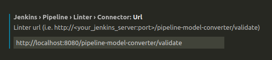

## Jenkins local linter server

Jenkins docker linter server to validate jenkinsfile during development. Used with VSCODE plugin.

To build jenkins image

```sh
make build
```
To run jenkins server

```sh
make run
```

- Plugin [link](https://marketplace.visualstudio.com/items?itemName=janjoerke.jenkins-pipeline-linter-connector)

Install plugin , configure extension fill only 'Connector URL' as per below

```sh
http://localhost:8080/pipeline-model-converter/validate
```



Refrence : https://dev.to/nicoavila/how-to-validate-your-jenkinsfile-locally-before-committing-334l
